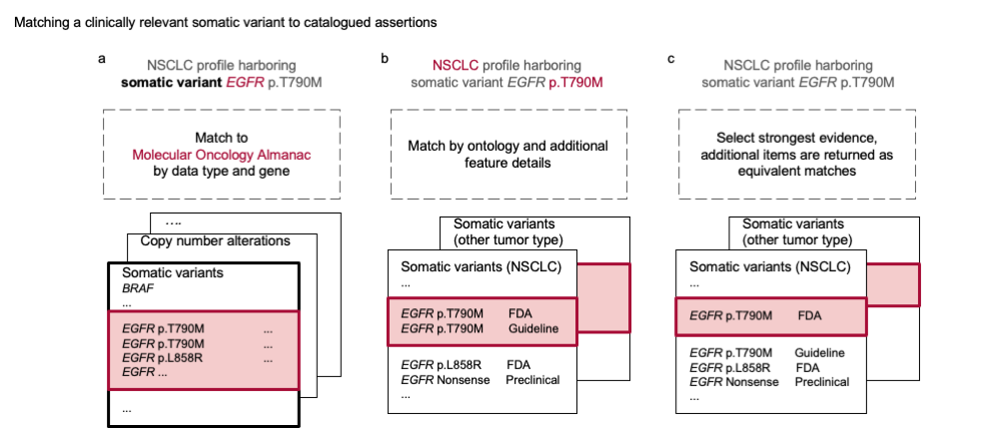

**Extended Data Fig. 1 | Illustrating a clinically relevant somatic variant matching to Molecular Oncology Almanac**. Molecular features whose gene is listed in Molecular Oncology Almanac (MOAlmanac) will at least be categorized as Biologically Relevant. Molecular features are then evaluated for assertions associated with therapeutic sensitivity, resistance, and prognosis independently. Consider the somatic variant _EGFR_ p.T790M harbored by a non-small cell lung cancer (NSCLC) tumor being evaluated for associations to therapeutic sensitivity: **a**, If a gene and corresponding feature type are catalogued in MOAlmanac for the assertion type being evaluated, the molecular feature will at least be labeled as "Investigate Actionability''. **b**, Next, MOAlmanac will prioritize assertions of the same ontology and then match by additional feature details. While _EGFR_ p.L858R is also a missense variant, the specific protein change p.T790M is catalogued by the database. _EGFR_ p.T790M is thus reported as “Putatively Actionable” as it was able to fully match to a molecular feature catalogued in the database. **c**, Of the remaining database entries, those associated with the highest evidence tier are selected. The first returned result is selected, unless an entry marked as a preferred assertion is present, and the remaining are returned as equivalent matches, viewable within the produced report.

[Google draw](https://docs.google.com/drawings/d/1sR67TYSZrsLosYZqjq0akKSxCE_XCNHsnozWxiH8XFo/edit)

