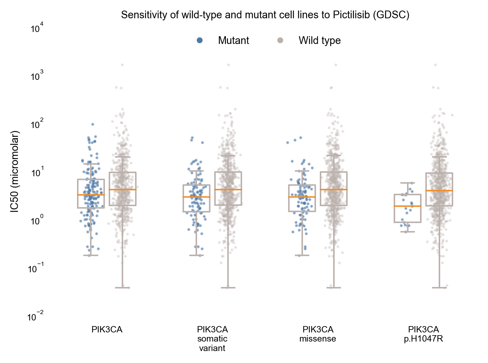

**Extended Data Fig. 2 | MOAlmanac investigates preclinical efficacy of nominated relationships**. If a nominated therapy has been characterized by the GDSC, MOAlmanac will investigate if cancer cell lines that are wild type and mutant for the associated molecular feature respond differently by comparing IC50 values using a two-sided Mann-Whitney-Wilcoxon test. For _PIK3CA_ p.H1047R and response to Pictilisib, response data was available for 766 cancer cell lines. MOAlmanac investigated sensitivity for mutant and wild type cell lines for cell lines harboring either a _PIK3CA_ somatic variant, copy number alteration, or fusion (n = 162 mutant cell lines, min IC50: 0.18, max: 93.92, median: 3.22, q1: 1.70, q2: 6.72; n = 604 wild type, min IC50: 0.04, max: 1616.65, median: 4.10, q1: 1.94, q3: 9.34), a _PIK3CA_ somatic variant (n = 103 mutant cell lines, min IC50: 0.18, max: 50.01, median: 2.90, q1: 1.42, q2: 5.14; n = 653 wild type, min IC50: 0.037, max: 1616.65, median: 4.10, q1: 1.95, q3: 9.54), _PIK3CA_ missense variants (n = 98 mutant cell lines, min IC50: 0.18, max: 50.01, median: 2.91, q1: 1.46, q2: 5.11; n = 668 wild type, min IC50: 0.037, max: 1616.65, median: 4.10, q1: 1.94, q3: 9.61), and the specific protein change _PIK3CA_ p.H1047R (n = 21 mutant cell lines, min IC50: 0.54, max: 5.63, median: 1.86, q1: 0.865, q2: 3.25; n = 745 wild type, min IC50: 0.037, max: 1616.65, median: 3.92, q1: 1.90, q3: 9.15). Data is available as source data.
