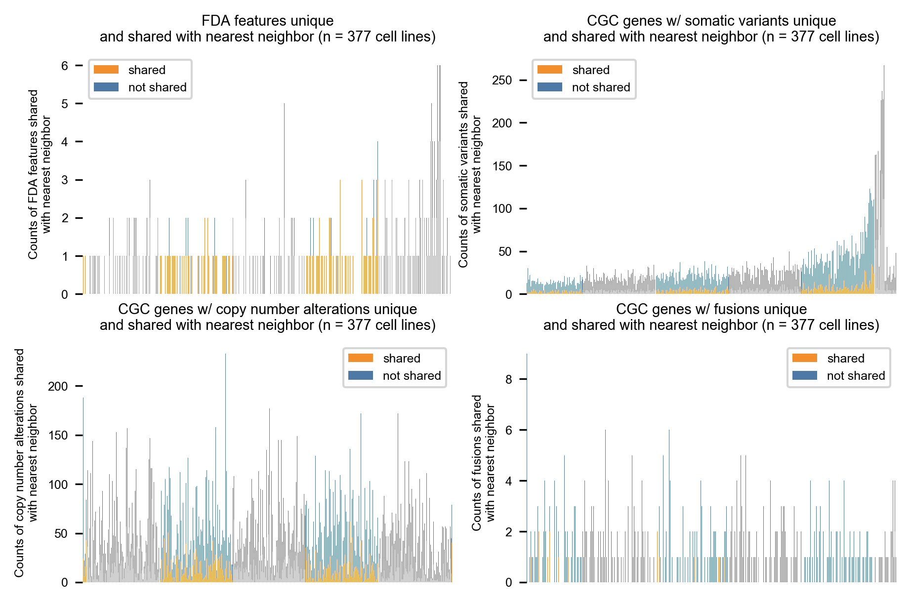

**Extended Data Fig. 3 | Number of features shared with nearest neighbors**. MOAlmanac performs profile-to-cell line matchmaking by applying Similarity Network Fusion (SNF) on four distance matrices: Cancer Gene Census (CGC) genes altered by somatic variants, CGC genes altered by copy number alterations, CGC genes altered by fusions, and specific molecular features associated with FDA approvals. 154/205 cancer cell lines which harbor at least one FDA approval share at least one with their nearest neighbor. Data is available as source data.