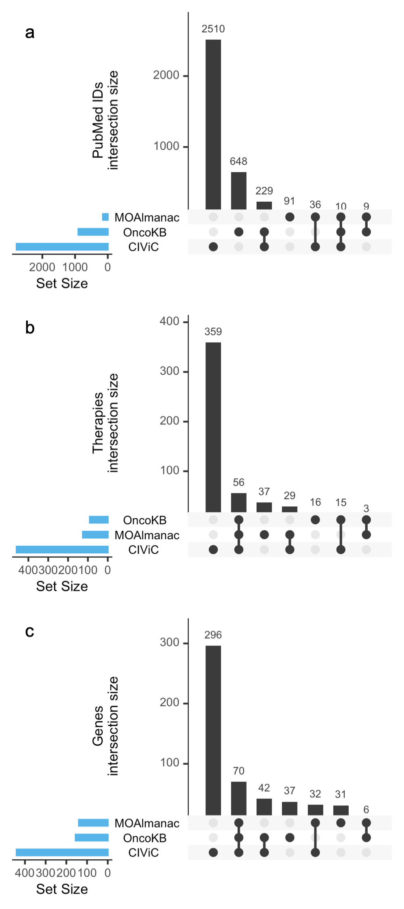

**Extended Data Fig. 4 | Comparison to OncoKB and CIViC**. Upset plots comparing PubMed ids, therapies, and genes catalogued by Molecular Oncology Almanac, OncoKB, and CIViC. No one knowledge base subsumes another. Data is available as source data. 
