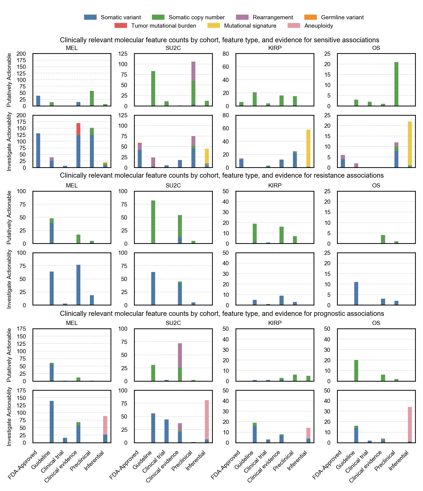

**Extended Data Fig. 5 | Counts of clinically relevant molecular features observed in retrospective cohorts by MOAlmanac by cohort, feature type, evidence, and assertion type**. Counts of clinically relevant molecular features associated with therapeutic sensitivity, resistance, and prognosis categorized as putatively actionable (exactly matching a fully characterized genomic event catalogued in MOAlmanac) or investigate actionability (partial match) by evidence tier for metastatic melanomas (MEL, n = 110), metastatic castration-resistant prostate cancer (mCRPC, n = 150), kidney papillary renal-cell carcinoma (KIRP, n = 100), and osteosarcoma (OS, n = 59). Data is available as source data. 