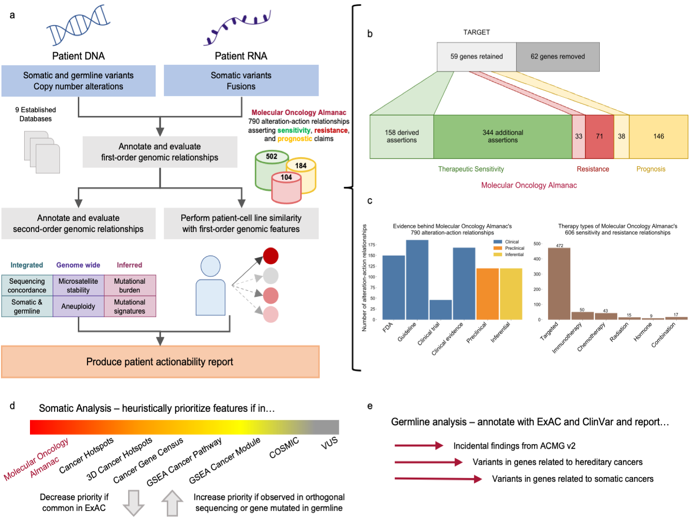

**Fig. 1 | Molecular Oncology Almanac, a clinical interpretation framework.** **a**, The Molecular Oncology Almanac (MOAlmanac) is a paired clinical interpretation algorithm and underlying knowledge base to enable integrative interpretation of multimodal genomics data for point-of-care decision-making and translational hypothesis generation. **b**, A literature review was performed to grow MOAlmanac’s underlying knowledge base from TARGET. **c**, Assertions catalogued in MOAlmanac, categorized by evidence (left) and therapy types (right). **d**, MOAlmanac matches molecular features to its own knowledge base and several others to prioritize somatic variants for clinical and biological relevance. **e**, Germline variants are evaluated for pathogenicity and allele frequency and reported if the gene is related to the American College of Medical Genetics and Genomics, hereditary cancers, or somatic cancers. Vignettes of how MOAlmanac annotates molecular features of each feature type can be found in Supplementary Table 1. TARGET and MOAlmanac as present in the study are available as Supplementary Table 2.  Data for panels **b**, c are available as source data.
