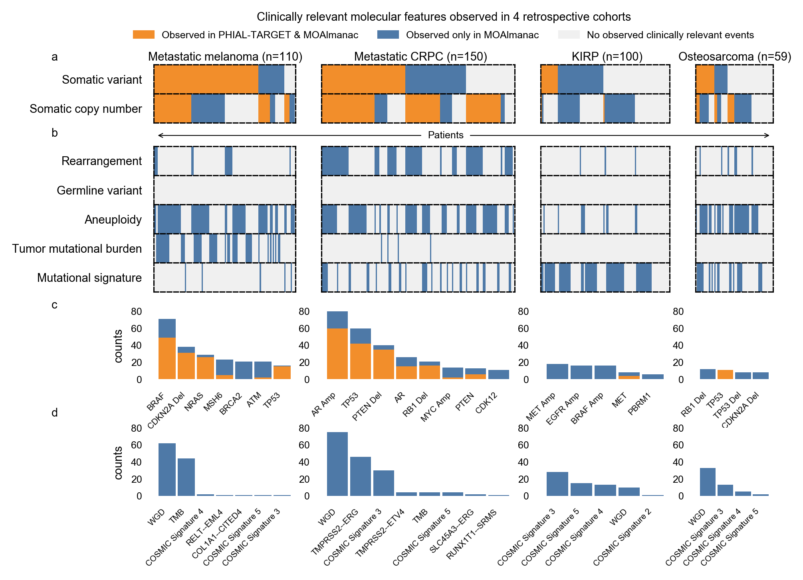

**Fig. 2 | MOAlmanac increases the number of nominated clinically relevant molecular features in four retrospective cohorts**. MOAlmanac was benchmarked against PHIAL & TARGET using the molecular profiles of 110 patients with metastatic melanoma, 150 with metastatic castration-resistant prostate cancer, 100 with kidney papillary renal cell carcinoma, and 59 with osteosarcoma. **a**, Molecular Oncology Almanac increased the number of patients with a clinically relevant somatic variant or copy number alteration from 295 to 365 relative to PHIAL; patients are aligned across feature types vertically. **b**, Molecular features not routinely used in clinical sequencing were utilized to expand translational hypotheses. **c**, Counts of clinically relevant somatic variants or copy number alterations by ontology. **d**, Counts of clinically relevant molecular features from expanded feature types. Data for panels are available as source data. 