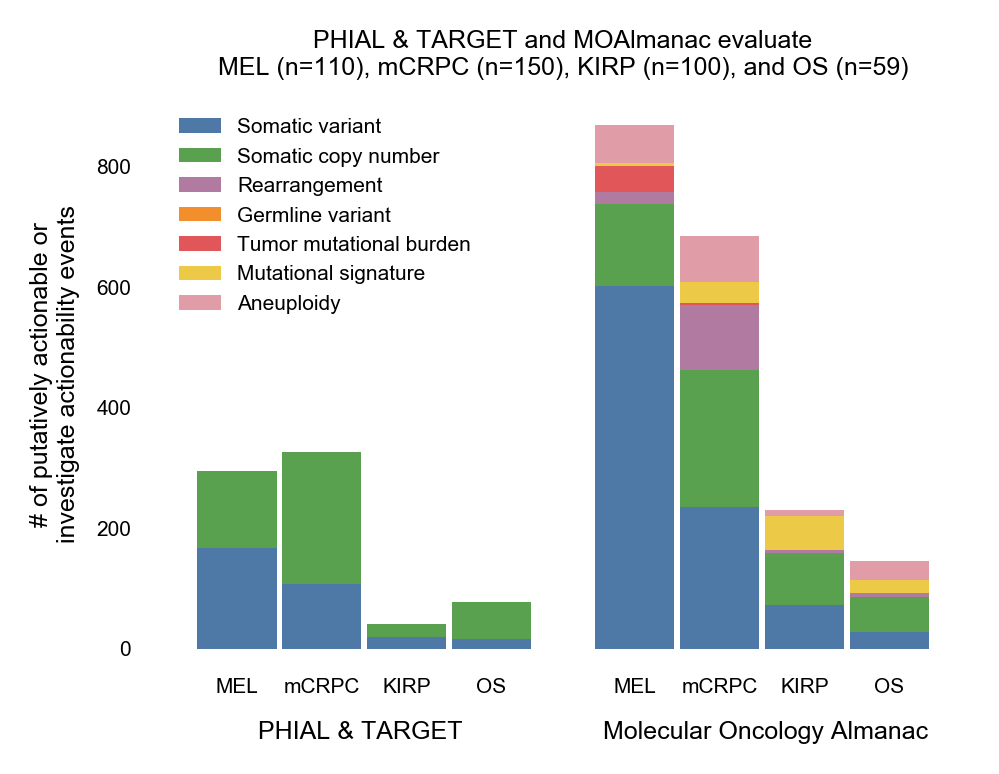

**Fig. 3 | Counts of clinically relevant molecular features observed in retrospective cohorts by method and feature type**. Counts of molecular features labeled as either putatively actionable or investigate actionability by PHIAL & TARGET vs MOAlmanac. Data is available as source data.
