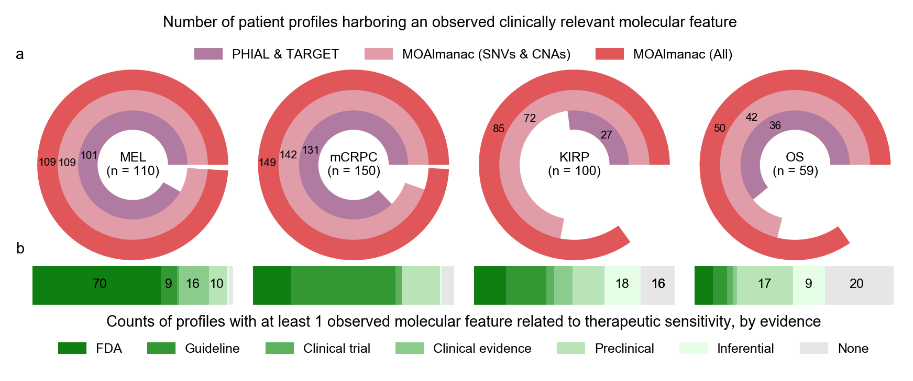

**Fig. 4 | MOAlmanac increases the number of patients with at least one clinically relevant alteration in four retrospective cohorts**. MOAlmanac was benchmarked against PHIAL & TARGET using the molecular profiles of 110 patients with metastatic melanoma, 150 with metastatic castration-resistant prostate cancer, 100 with kidney papillary renal cell carcinoma, and 59 with osteosarcoma. **a**, MOAlmanac reduces the number of patients with at least one clinically relevant alteration over PHIAL-TARGET and reduces the number of otherwise variant-negative patients by considering additional feature types. **b**, Including preclinical evidence for evidence for therapeutic sensitivity provides an additional 68 patients with a molecularly matched therapeutic hypothesis. Data for panels are available as source data. 
