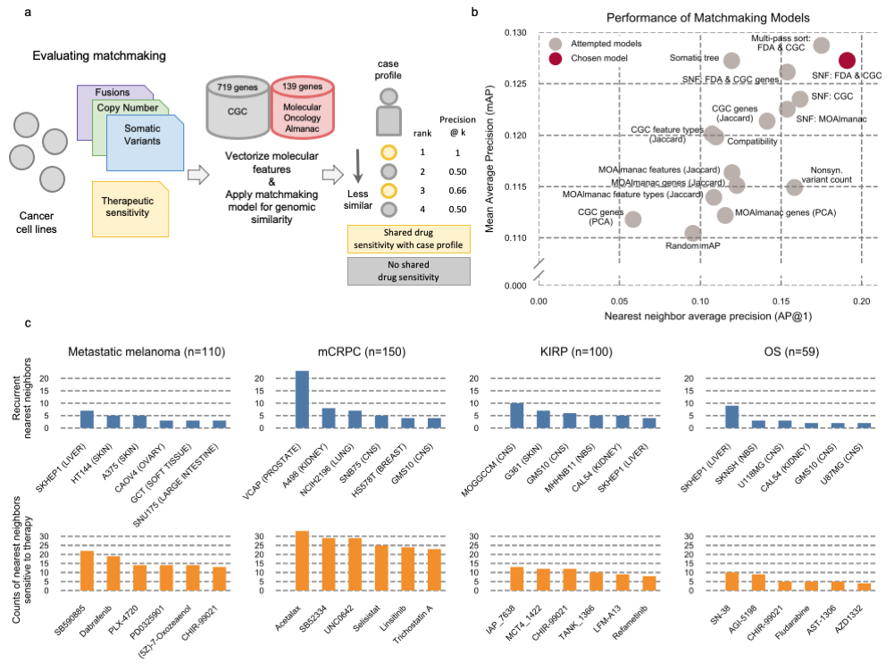

**Fig. 5 | Profile-to-cell line matchmaking**. MOAlmanac leverages preclinical data from cancer cell lines which have been molecularly characterized and subject to high-throughput therapeutic screens to provide supplemental hypotheses through profile-to-cell line matchmaking. **a**, Somatic SNVs, CNAs, and fusions of cancer cell lines are formatted, annotated with MOAlmanac and CGC, and vectorized into sample x feature boolean dataframes. Feature sets and similarity metrics were evaluated by their ability to sort cell lines relative to one another based on shared genomic features, such that cell lines that shared therapeutic sensitivity were deemed more similar. Metrics from information retrieval were used for evaluation (Methods). **b**, Models were evaluated on cancer cell lines using a hold-one-out approach. The chosen model utilized Similarity Network Fusion to combine networks of somatic variants, copy number alterations, and fusions in CGC genes with specific MOAlmanac features associated with an FDA approval. **c**, Recurrent nearest neighbors and their sensitive therapies for four patient cohorts. Data for panels **b**, **c** are available as source data.
