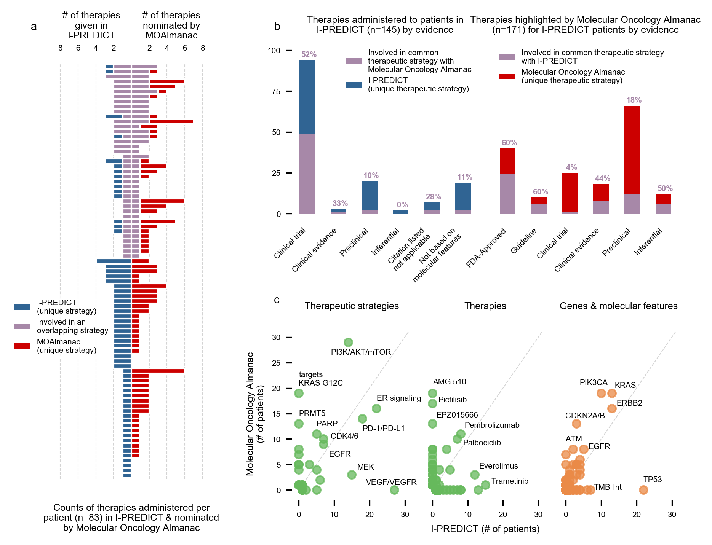

**Fig. 6 | Application of MOAlmanac to a prospective clinical trial**. We investigated if MOAlmanac could highlight similar therapeutic strategies that were utilized by real world evidence. MOAlmanac was applied to the I-PREDICT trial, which evaluated the efficacy of molecularly matched therapies in 83 patients. Therapies and corresponding molecular features were mapped to therapeutic strategies for those administered in I-PREDICT and highlighted by MOAlmanac. **a**, A shared therapeutic strategy was observed in 39 (47%) of patients, 31 of which involved a therapy most prioritized for the patient by MOAlmanac. **b**, MOAlmanac nominated therapeutic strategies applied for a given patient more often for those based on well-established evidence (i.e., FDA approvals; 60% of therapy patient pairs) relative to less established evidence, such as preclinical (18%). **c**, Therapeutic strategies, individual therapies, and genes and molecular features as administered or targeted by I-PREDICT and highlighted by Molecular Oncology Almanac. Data for panels are available as source data. 
