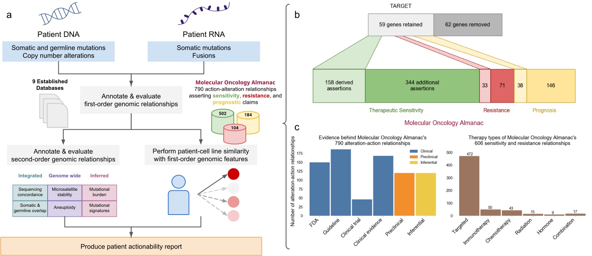

# Figure 1
Molecular Oncology Almanac, a clinical interpretation framework.

(a) The Molecular Oncology Almanac accepts any combination of somatic single nucleotide variants (snvs), insertions and deletions (indels), copy number alterations (cnas), germline snvs and indels, somatic snvs from orthogonal sequencing, and rearrangements from RNA. Molecular features are annotated for clinical relevance and with several other data sources before being heuristically sorted (first-order). Variants are used to evaluate genomic features; somatic-germline overlap, concordance of somatic variants with orthogonal sequencing, COSMIC mutational signature contributions, mutational burden, and MSI related variants (second-order). Somatic mutations, copy number alterations, and fusions are used to assess similarity to individual cell lines for further therapeutic sensitivity suggestions. A report of putative actionability is generated (Methods). (b) A literature review was performed to identify relationships between molecular alterations and clinical actions for precision oncology, beginning with relationships suggested in TARGET. 62 genes were removed from TARGET due to insufficient evidence and 59 were retained. Clinical relationships were cataloged as suggesting therapeutic sensitivity, resistance, or prognostic value in an SQL database (Methods) and made available online (https://moalmanac.org). (c) Sources catalogued in the Molecular Oncology Almanac, categorized by evidence (left) and therapy types (right).
