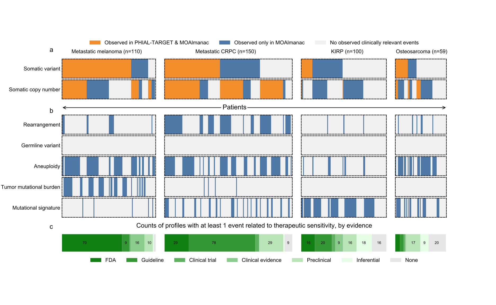

# Figure 2
Benchmarking MOAlmanac against PHIAL & TARGET.

Molecular Oncology Almanac was benchmarked against PHIAL & TARGET using the molecular profiles of 110 patients with metastatic melanoma, 150 with metastatic castration-resistant prostate cancer, 100 with kidney papillary renal cell carcinoma, and 59 with osteosarcoma. (a) Molecular Oncology Almanac increased the number of patients with a somatic variant or copy number alteration labeled as “putatively actionable” or “investigate actionability” from 295 to 365 relative to PHIAL; patients are aligned across feature types vertically. (b) Features not routinely used in clinical sequencing were utilized to characterize actionability: rearrangements, germline variants, aneuploidy, mutational burden, and mutational signatures; patients aligned with (A) vertically. (c) Including preclinical evidence for therapeutic sensitivity provides an additional 68 patients (10 with metastatic melanoma, 26 metastatic castration-resistant prostate cancer, 14 papillary renal cell carcinoma, and 16 osteosarcoma) with a molecularly matched therapeutic hypothesis. 