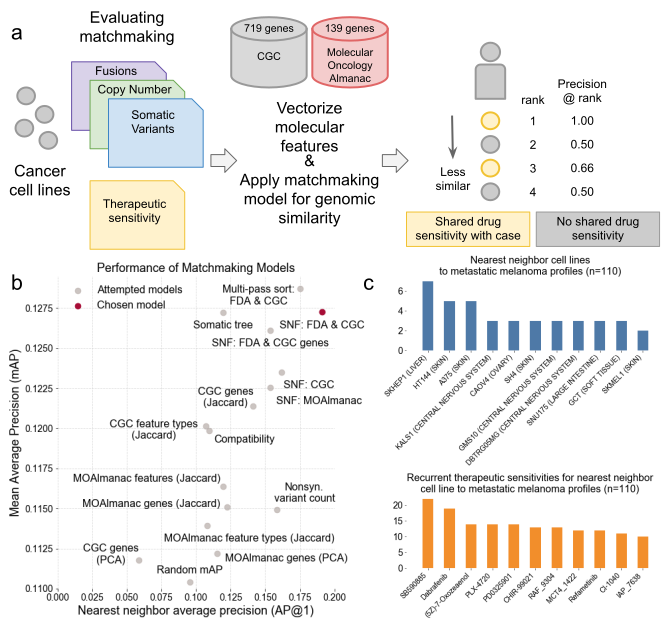

# Figure 3
Leveraging preclinical models in MOAlmanac.

MOAlmanac leverages preclinical data from cancer cell lines which have been molecularly characterized and subject to high-throughput therapeutic screens to provide supplemental hypotheses through profile-to-cell line matchmaking. (a) Somatic SNVs, CNAs, and fusions of cancer cell lines are formatted, annotated with MOAlmanac and CGC, and vectorized into sample x feature boolean dataframes. Feature sets and similarity metrics were evaluated by their ability to sort cell lines relative to one another based on shared genomic features, such that cell lines that shared therapeutic sensitivity were deemed more similar. Metrics from information retrieval were used for evaluation; mean average precision (mAP, how the model does overall at sorting cell lines which share therapeutic sensitivity to be closer to the case profile) and average precision at rank 1 (ap@1, how often the nearest neighbor shared therapeutic sensitivity). (b) Models were evaluated on 377 cancer cell lines using a hold-one-out approach. The model which had the strongest trade off between the two metrics used Similarity Network Fusion to fuse networks of somatic variants, copy number alterations, and fusions in CGC genes with specific MOAlmanac features associated with an FDA approval. (c) Recurrent nearest neighbors and their sensitive therapies for 110 patients with metastatic melanomas. SKHEP1_LIVER (BRAF  p.V600E positive) was the first neighbor for 7 profiles, A375_SKIN for 5, and HT144_SKIN for five. Nearest neighbors were sensitive to RAF inhibitors: SB590885 (BRAF inhibitor, 22 neighbors), Dabrafenib (19), and PLX-4720 (Vemurafenib, 14).