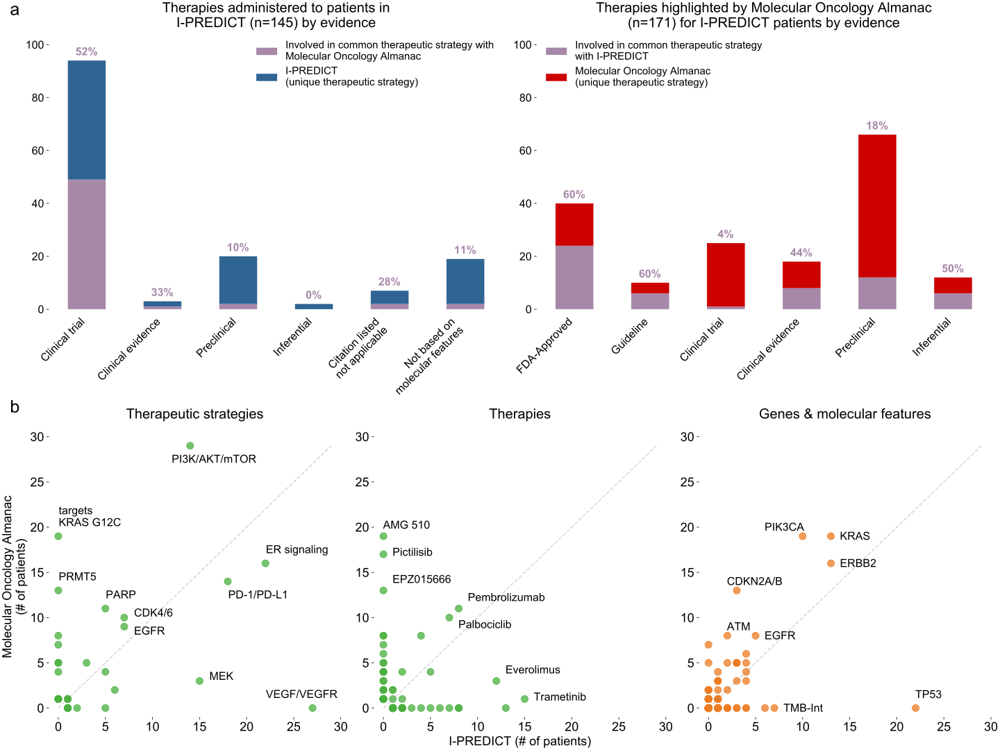

# Figure 4
Application of MOAlmanac to a prospective clinical trial.

We investigated if MOAlmanac could highlight similar therapeutic strategies that were utilized by real world evidence. MOAlmanac was applied to the I-PREDICT trial, which evaluated the efficacy of molecularly matched therapies in 83 patients. (a) Therapies and corresponding molecular features were mapped to therapeutic strategies for those administered in I-PREDICT and highlighted by MOAlmanac. MOAlmanac nominated therapeutic strategies applied for a given patient (purple) more often for those based on well established evidence (i.e. FDA approvals; 60% of therapy patient pairs) relative to less established evidence, such as preclinical (18%). Counts of therapeutic strategies applied to patients that were unique to I-PREDICT are shown in blue and those highlighted by and unique to MOAlmanac are in red. (b) Therapeutic strategies, individual therapies, and genes and genomic events as administered or targeted by I-PREDICT and highlighted by Molecular Oncology Almanac. 