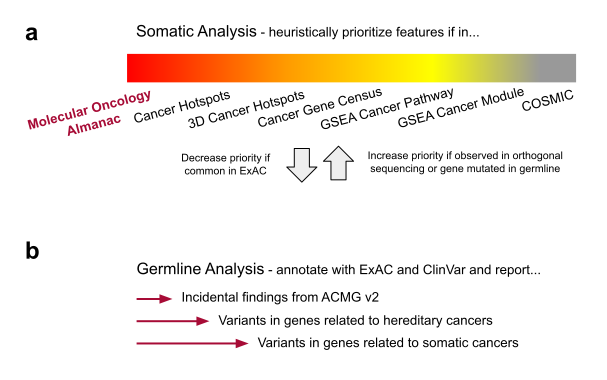

# Supplementary Figure 1
Schematics of heuristics for sorting of somatic and germline variants. 

(a) Like PHIAL, the Molecular Oncology Almanac heuristically evaluates somatic variants and will decrease variant priority if likely to be a common variant or increase variant priority if observed in validation sequencing. (b) The Molecular Oncology Almanac will annotate provided germline variants for pathogenic or likely pathogenic status of rare or uncommon variants to report incident findings based on the American College of Medical Genetics v2, variants in genes related to hereditary cancers, and variants in genes related to somatic cancers. Vignettes of how MOAlmanac annotates molecular features of each feature type can be found in Supplementary Table 1.

[Google Draw](https://docs.google.com/drawings/d/1-RLuYdiMCCokzuv6f-ajF3cr6iVRcKn8JpXiJNWMg_k/edit)

