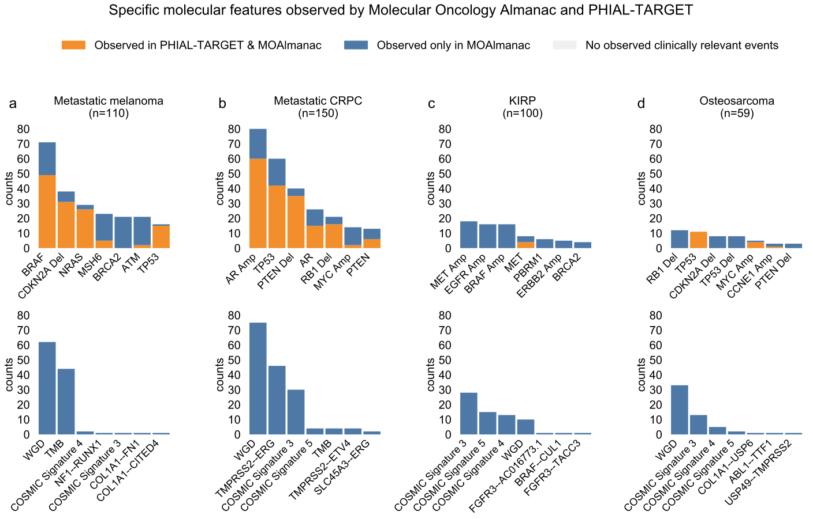

# Supplementary Figure 3

Benchmarking MOAlmanac against PHIAL & TARGET, observed clinically relevant features.

Counts of molecular features labeled as either putatively actionable or investigate actionability, thus being associated with a clinical action, by PHIAL & TARGET vs Molecular Oncology Almanac (MOAlmanac). Events observed by both (orange) and by MOAlmanac only (blue) are shown. Somatic variants and copy number alterations are shown (top) alongside additional molecular features (germline variants, rearrangements, aneuploidy, mutational signatures, tumor mutational burden; bottom) for (a) metastatic melanoma, (b) metastatic castration-resistant prostate cancer, (c) papillary renal cell carcinoma, and (d) osteosarcoma. Abbreviations used: WGD = whole genome doubling, TMB = tumor mutational burden. This does not include “Biologically Relevant” features from MOAlmanac or “High Priority” from PHIAL & TARGET, neither of which are directly associated with clinical assertions.
