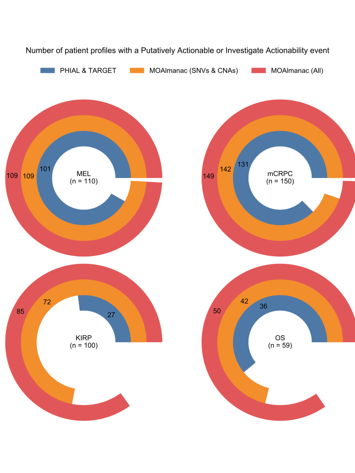

# Supplementary Figure 5
Number of patient profiles with a clinically relevant (labeled as Putatively Actionable or Investigate Actionability by either PHIAL or MOAlmanac) event.

Molecular Oncology Almanac (MOAlmanac) and PHIAL identify clinically relevant molecular features within molecular profiles. PHIAL (blue) leverages the TARGET database and considers somatic variants and copy number alterations. MOAlmanac identified additional patients with metastatic melanoma (MEL), metastatic castration-resistant prostate cancer (mCRPC), kidney renal cell carcinoma (KIRP), and osteosarcoma (OS) both when restricting to somatic variants and copy number alterations (orange) and considering all feature types (red). 
