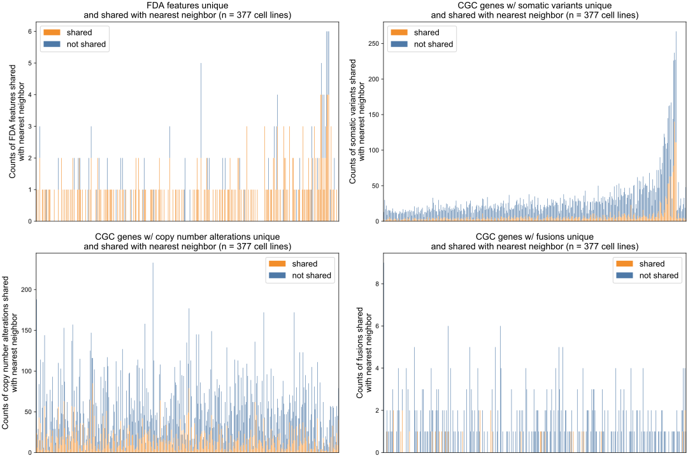

# Supplementary Figure 7
Counts of features associated with an FDA approval and CGC genes altered across feature types shared or not shared with nearest neighbor for profile-to-cell line matchmaking, as evaluated on cell lines. 

Profile-to-cell line matchmaking is by applying Similarity Network Fusion (SNF) on four distance matrices: Cancer Gene Census (CGC) genes altered by somatic variants, CGC genes altered by copy number alterations, CGC genes altered by rearrangements, and specific molecular features associated with FDA approvals as catalogued by Molecular Oncology Almanac. Each vertical (x-axis) represents one cell line and the counts (y-axis) are the number of alterations observed in a given cell line for that data type. Counts of alterations shared with the cell line’s nearest neighbor are colored orange and those not shared are colored blue. 154/205 profiles which harbor at least one FDA approval share at least one with their nearest neighbor.
