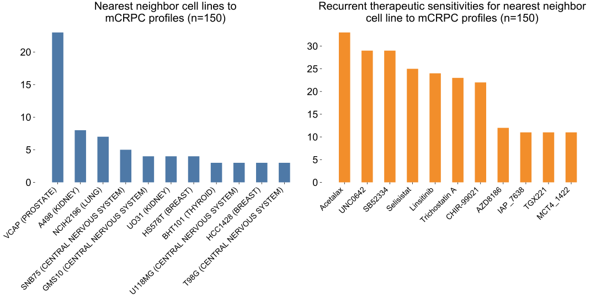

# Supplementary Figure 8
Profile-to-cell line matchmaking for mCRPC profiles (n = 150).

Of 150 patients with mCRPC, 25 observed the nearest neighbor to one of two prostate cancer cell lines present in the cohort of 452 cancer cell lines (left). The recurrent therapies that nearest neighbors were sensitive to are not widely considered in prostate cancer (right).
