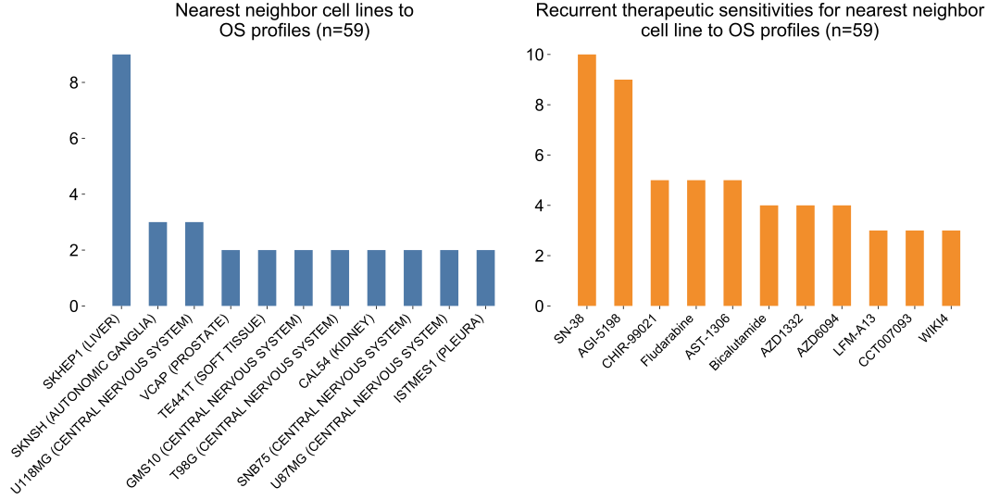

# Supplementary Figure 10
Profile-to-cell line matchmaking for 59 OS profiles.

Profile-to-cell line matchmaking results from 59 OS profiles. Recurrent nearest neighbors (left) and common therapies which nearest neighbors are sensitive to (right).

