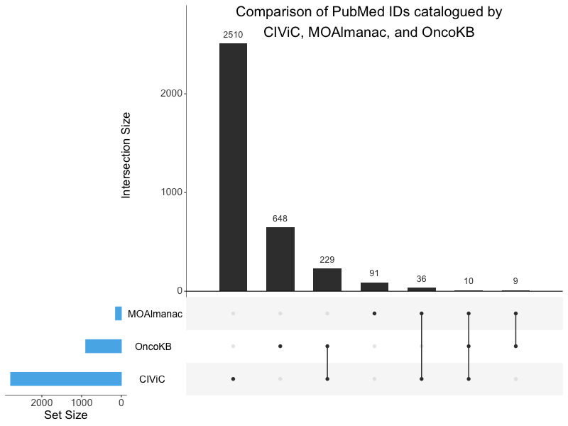

# Supplementary Figure 13
PubMed ID comparison to OncoKB and CIViC.

UpSet plot comparing PubMed IDs (PMIDs) catalogued by CIViC, Molecular Oncology Almanac, and OncoKB. Molecular Oncology Almanac also catalogues clinical guidelines and FDA approvals without PMIDs. No one knowledge base subsumes another. The x-axis represents different intersection sizes, or portions of a venn-diagram. The top row corresponds to PMIDs contained by Molecular Oncology Almanac, the second row OncoKB, and third row CIViC. Filled dots along a knowledge base’s row indicate membership of the intersection displayed along the vertical; for example, the second vertical displays a set of 648 PMIDs which are unique to OncoKB and the third vertical displays a set of 229 PMIDs that are shared by OncoKB and CIViC. 

