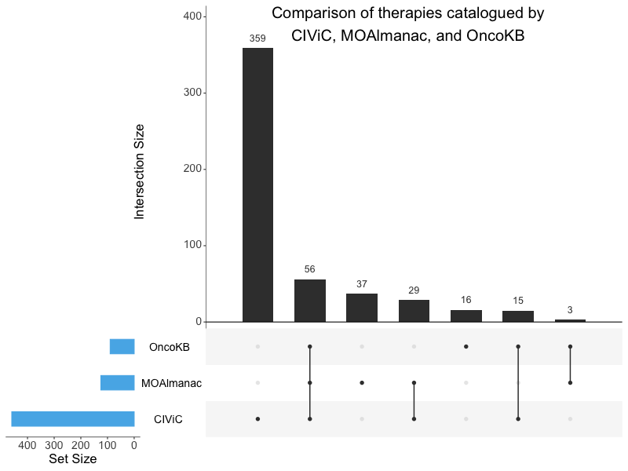

# Supplementary Figure 14
PubMed ID comparison to OncoKB and CIViC.

UpSet plot comparing therapies catalogued by CIViC, Molecular Oncology Almanac, and OncoKB. No one knowledge base subsumes another. The x-axis represents different intersection sizes, or portions of a venn-diagram. The top row corresponds to therapies contained by OncoKB, the second row Molecular Oncology Almanac, and third row CIViC. Filled dots along a knowledge base’s row indicate membership of the intersection displayed along the vertical; for example, the second vertical displays a set of 56 therapies shared by all three knowledgebases while the first vertical displays a set of 359 therapies unique to CIViC. 
