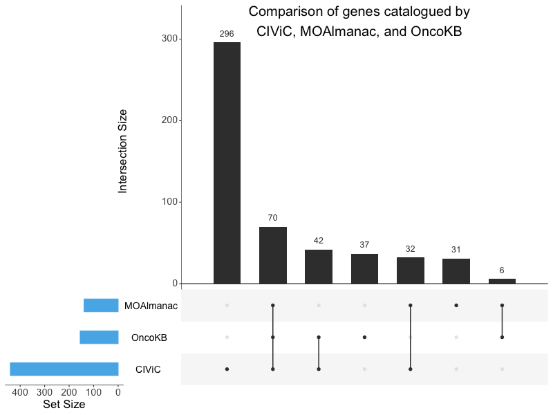

# Supplementary Figure 15
Gene comparison to OncoKB and CIViC. 

UpSet plot comparing genes catalogued by CIViC, Molecular Oncology Almanac, and OncoKB. No one knowledge base subsumes another. The x-axis represents different intersection sizes, or portions of a venn-diagram. The top row corresponds to genes contained by Molecular Oncology Almanac, the second row OncoKB, and third row CIViC. Filled dots along a knowledge base’s row indicate membership of the intersection displayed along the vertical; for example, the second vertical displays a set of 70 genes shared by all knowledge bases while the first displays a set of 296 genes unique to CIViC. 