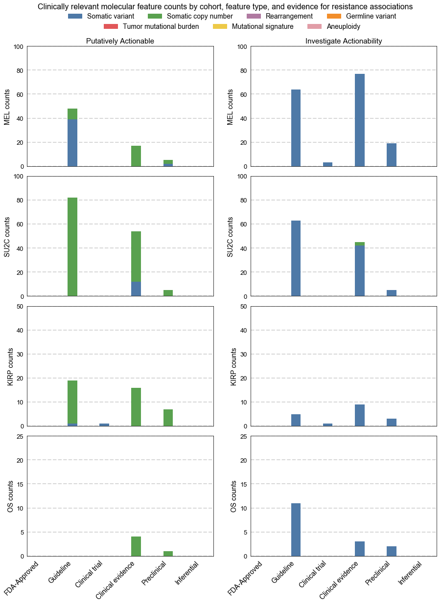

# Supplementary Figure 17
Counts of clinically relevant molecular features by cohort, feature type, and evidence for therapeutic resistance associations for retrospective cohorts.

Counts of observed molecular features associated with therapeutic resistance categorized as putatively actionable (exactly matching a fully characterized genomic event catalogued in MOAlmanac) or investigate actionability (partial match) by evidence tier for metastatic melanomas (n = 110), mCRPC / SU2C (n = 150), kidney papillary renal-cell carcinoma (n = 100), and osteosarcoma (n = 59). 
